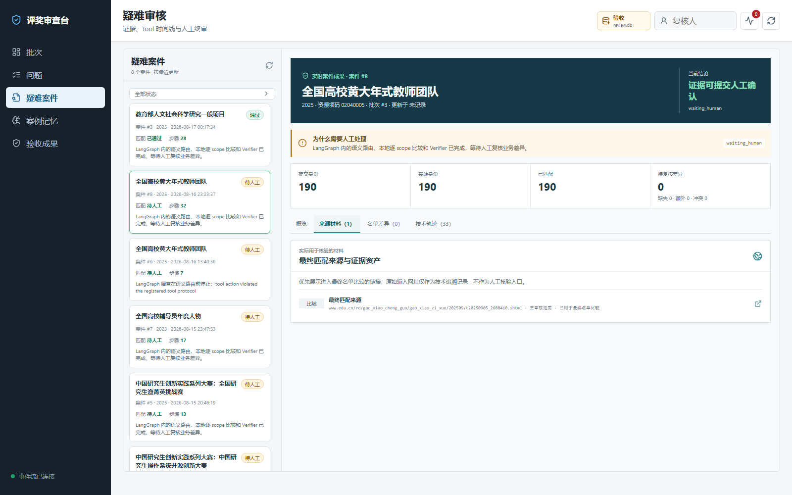
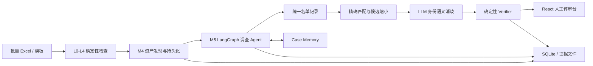

# Award Audit: 可审计的评奖审查 Agent

Award Audit 是一个面向公开奖项名单核查的本地优先审核系统。系统导入批量 Excel
提交材料，通过确定性规则、联网取证、LangGraph 调查流程和人工复核台，核对官网
网页、Excel、PDF、扫描件及图片名单，并保留完整的证据与决策轨迹。

项目的核心目标不是让大模型直接宣布“审核通过”，而是让模型在受控范围内负责计划、
材料语义路由和身份消歧；文件安全、精确匹配、数量约束、证据引用和最终门禁由本地代码
执行。证据不充分时系统 fail-closed，明确转入人工处理。

## 评审台

评审台采用案件主从视图：左侧按最近更新时间列出案件，右侧展示当前案件的审核成果、scope 比较、
最终核验来源、名单差异、技术轨迹与人工处理操作。对原网址不可达的案件，人工核验入口展示实际
进入最终名单比对的替代来源，而不是失效的初始线索 URL。



评审台支持案件主从视图、证据链、差异比较和人工核验。

## 核心能力

- 支持批量提交材料导入和 L0-L4 确定性检查。
- M4 可发现并持久化网页正文、附件、PDF 和图片资产。
- M5 默认通过 LangGraph 编排规划、工具执行、语义路由、比较和 Verifier。
- 支持 HTML、XLS/XLSX、文本 PDF、扫描 PDF、网页图片和无扩展名附件。
- 支持本地精确匹配以及受约束的 LLM 身份语义消歧。
- 提供 FastAPI + React 评审台，展示节点时间线、工具调用、证据锚点、差异和人工操作。
- 使用 SQLite 保存批次、案件、Graph 状态、Trace、比较结果和案例记忆。

## 代码目录

```text
award-audit/
├── src/award_audit/          # 核心业务代码
│   ├── core/                 # Excel 导入、确定性规则、SQLite 持久化
│   ├── agent/                # M4/M5、LangGraph、工具、Verifier、案例记忆
│   ├── web/                  # FastAPI 接口、任务与 SSE 事件流
│   ├── cli/                  # 命令行入口
│   └── tui/                  # 终端复核界面
├── webui/                    # React + TypeScript 评审台前端
├── tests/                    # 单元、集成、Web 与 Agent 回归测试
├── scripts/                  # 公开的验收、样本、评测与通用探针
├── assets/                   # README 使用的公开图片资源
├── out/                      # 本地运行结果和反馈文件，默认不进入 Git
├── tmp/                      # 临时数据库、证据和测试产物，默认不进入 Git
└── pyproject.toml            # Python 包、依赖、CLI 与测试配置
```

日常运行使用安装后的命令 `award-web`、`award-audit` 与 `award-db`；它们由
[`pyproject.toml`](pyproject.toml) 注册。`scripts/` 不会被评审台自动调用，公开内容按用途分层：

| 脚本类别 | 示例 | 用途 |
| --- | --- | --- |
| `acceptance/` | `run_m5_case.py`、`run_m5_scanned_pdf_graph_acceptance.py` | 复跑通用 M5 与扫描 PDF Graph 验收 |
| `fixtures/` | `gen_m5_pdf_samples.py`、`gen_m5_vision_samples.py`、`make_dirty_sample.py` | 生成可重复的 PDF、图片和脏数据样本 |
| `evals/` | `eval_m5.py` | 评估脱敏固定测试集表现 |
| `probes/` | `probe_m5_pdf_ocr.py`、`probe_m5_security.py`、`probe_m5_sqlite_wal.py` | 验证 OCR、安全与 SQLite 并发等通用能力 |

与特定第三方站点、真实提交批次、真实 API 或本地演示数据相关的诊断脚本保留在
`scripts/local/`。该目录被 Git 忽略，不会出现在公开仓库；其余说明见
[`scripts/README.md`](scripts/README.md)。

## 系统架构



技术栈：Python 3.10、FastAPI、LangGraph、Pydantic、SQLite、React、TypeScript、
OpenPyXL、PyPDF、pdfplumber、RapidOCR，以及 OpenAI 兼容模型 API。

项目的运行方式和核心流程见本 README 后续章节。

## LangGraph 如何使用

项目使用 LangGraph 管理有状态流程、节点执行和条件转移，而不是把所有审核逻辑交给模型。
当前主图定义在
[`graph.py`](src/award_audit/agent/investigation/graph.py)，包含 12 个业务节点：

```text
prepare_case
-> retrieve_memory
-> semantic_plan
-> execute_tool
-> observe
-> assess_extraction_quality
-> semantic_route_assets
-> build_exact_matches_and_candidates
-> semantic_adjudicate_identities
-> deterministic_verify
-> persist
-> waiting_human
```

其中存在两类主要条件边：

- `semantic_plan` 根据严格结构化 Action 选择执行工具、进入语义路由或转人工。
- `assess_extraction_quality` 判断继续处理已准备批次、重新规划或转人工。
- 后续业务节点只在本地检查成功时继续；任何协议、预算、证据或 Verifier 失败都会
  fail-closed。

工具不会无条件全部运行。Graph 先根据资产类型准备受限批次：HTML/Excel/完整文本材料
可以直接进入语义路由；图片和扫描 PDF 才进入 OCR/视觉处理；同一已准备批次连续处理，
避免每页或每张图片都重新调用 Planner。

## 证据处理

| 材料类型 | 处理路径 |
| --- | --- |
| HTML | 本地快照、正文和表格提取，SHA-256 校验后进入语义路由 |
| Excel | 工作表解析、表头识别、逐行名单记录 |
| 文本 PDF | 页级文字/表格提取和完整性检查 |
| 扫描 PDF | 页面渲染、OCR，必要时视觉模型回退 |
| 网页图片 | 下载、安全检查、哈希去重、OCR/视觉、多图合并 |
| 无扩展名附件 | 依据文件魔数识别真实类型，不依赖 URL 后缀 |

所有来源记录携带资产 ID、URL、本地路径、SHA-256 和页/行锚点。模型只能引用输入协议中
真实存在的资产、scope 和身份候选，不能自行创建证据。

## 案例记忆

案件记忆采用人工治理的生命周期，而不是自动学习模型输出：

```text
案件完成并由人工作出明确决定
-> 生成 candidate 记忆
-> 复核人批准为 active
-> 后续相似案件最多检索 Top-3
-> deprecated 或 merged
```

检索会限制问题分类、资源类型、字段、适用日期和文本相关性。未经人工批准的候选记忆
不会影响后续案件。实现见
[`service.py`](src/award_audit/agent/memory/service.py)。

## 本地运行

### 1. 安装后端

```powershell
conda create -n awardenv python=3.10 -y
conda activate awardenv
python -m pip install -e ".[agent,web,m5-pdf]"
```

复制 `.env.example` 为本机 `.env` 并填写所需 API 配置。不要提交 `.env`、数据库、
真实审核材料或证据文件。

### 2. 构建前端

```powershell
Set-Location webui
npm.cmd ci
npm.cmd run build
Set-Location ..
```

### 3. 启动评审台

建议每次验收使用独立数据库和目录：

```powershell
$run = "out/local-review"
New-Item -ItemType Directory -Force "$run/evidence", "$run/imports" | Out-Null

award-web `
  --db "$run/review.db" `
  --evidence-root "$run/evidence" `
  --import-root "$run/imports" `
  --environment acceptance `
  --host 127.0.0.1 `
  --port 8771
```

服务默认绑定 loopback 地址。浏览器访问 `http://127.0.0.1:8771`。

评审台通过浏览器多选 `.xlsx` 文件并上传到受管导入目录，不要求用户输入服务器本地路径。
每次上传都会生成独立批次目录，不覆盖之前的批次和审核结果。原路径导入 API 仅保留给本机
管理员和兼容流程。

## 审计数据设计

SQLite 同时保存业务状态和审计状态，包括批次、案件、attempt、任务、Graph 节点事件、
工具 Trace、证据索引、scope 比较、Verifier 和案例记忆。

支持按开发、验收和正式业务用途隔离审计数据：

```text
tmp/dev-review.db                  # 可重建的开发库
out/acceptance-<timestamp>/review.db  # 独立验收库
<configured production path>      # 正式库，备份并受控归档
```

重新审核通过新批次或补证 attempt 完成，旧批次、旧 attempt 和人工结论持续保留，可用于
来源追溯、结果对比和复核。

数据库健康检查和在线备份：

```powershell
award-db inspect --db "out/acceptance-<timestamp>/review.db"
award-db backup --db "<正式库路径>" --output "<新的备份路径>"
```

SQLite 数据库通过版本化 schema 和迁移脚本维护，运行时数据目录不纳入公开仓库。

审核后发现问题时按问题来源处理：提交 Excel 内容有误时，人工修改原始文件并重新上传为
新批次；官方材料不足时，在原案件发起“要求补充证据”，创建新的 supplement attempt；仅需
确认业务差异时，保存人工接受、拒绝或证据不足结论。系统不自动改写用户 Excel，旧批次、
旧 attempt 和人工结论继续保留以供审计。

## 工程保障

项目已有单元测试、集成测试、Web API/E2E 测试和真实案例验收 Harness。

```powershell
python -m pytest --basetemp tmp/pytest-local -p no:cacheprovider -q
python -m ruff check src tests
python -m mypy src
```

Graph 工程流程评测已经覆盖：

- 固定节点和条件边是否按预期执行；
- 工具白名单、结构化 Action 和协议纠错；
- HTML/Excel/PDF/图片的正确分流；
- 已准备媒体批次顺序和重复调用抑制；
- 预算、超时、案件重跑、attempt 隔离和合法终止；
- 语义路由、精确比较、身份候选、Verifier 和持久化；
- 不完整证据的 fail-closed 行为。

验收入口见：

- [`acceptance.py`](src/award_audit/agent/harness/acceptance.py)
- [`run_submission_case_acceptance.py`](scripts/run_submission_case_acceptance.py)
- M5 语义路由、证据处理和人工核验流程均由公开源码中的模块与测试覆盖。

## 可信性与安全设计

- 搜索结果只是候选线索，必须经过下载、内容检查和 Verifier。
- 文件访问受允许根目录、大小、类型、魔数和 SHA-256 约束。
- LLM 输出经过 Pydantic 严格校验，非法协议有限纠错后停止。
- 工具调用受次数、Token、时间和资产批次预算约束。
- 缺失、冲突、无法访问或无法确认的证据进入人工处理，不伪装为审核完成。
- `.env`、`*.db`、`data/`、`out/`、`tmp/` 和真实材料不进入 Git。
